#  desk-companion

**Turn the phone on your desk into a live window on Claude Code, with Clawd keeping you company.**

desk-companion is a Claude Code plugin. Prop your phone up next to your keyboard and it becomes an always-on dashboard for everything Claude is doing: how much of your 5-hour, weekly and Fable limits you've used and when they reset, every active session with its model, effort, context and current step, and Clawd, Claude's little mascot, acting out each session in turn.

Clawd isn't a looping GIF. He's a live SVG rig with 26 hand-timed animations that follow your sessions as they happen:
- **Your sessions at work:** he taps at a tiny laptop while Claude edits, lifts a dumbbell while it builds and runs tests, and ponders with thought dots while it thinks.
- **When Claude needs you:** he hops with a "!" when there's a permission prompt, and waves the checkered flag when it's your turn.
- **Your limits:** he gets tired and then worried as they run down, turns red and steams when one is used up, and throws confetti when they reset.
- **When nothing's happening:** he blinks, glances around, strolls across the desk, and after a quiet spell yawns and curls up to sleep. Tap him to say hi.

Everything runs on your own machine. The plugin starts a small web server on your PC, and any phone or tablet browser on the same Wi-Fi opens the dashboard. There's no app to install, no account and no cloud.

<p align="center">
  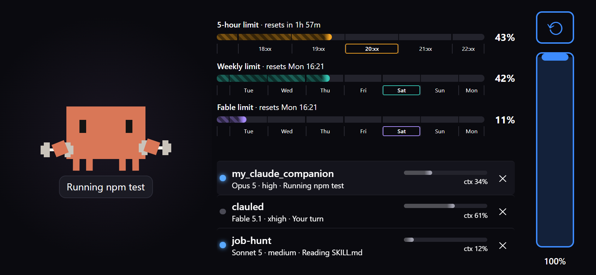
  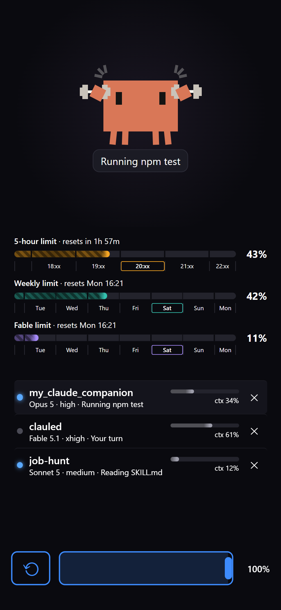
</p>

<p align="center">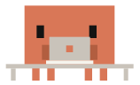 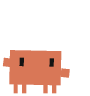 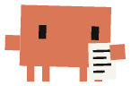 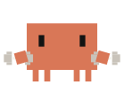 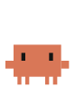 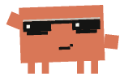 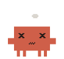 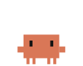  </p>

Independent project, not affiliated with Anthropic.

##  How it works

```
Claude Code hooks  ──►  local server on your PC  ──►  phone browser on your Wi-Fi
(what each session        (sessions, limits via          (limit bars, sessions,
 is doing, sanitised)      Claude Code's get_usage)       Clawd, live over SSE)
```

##  Requirements

- Claude Code on the PC: the terminal CLI and/or the desktop app's Code tab.
- Node 18 or later.
- For limits: the Claude Code CLI on PATH, signed in with your claude.ai account (`claude auth login`). The desktop app's sign-in isn't shared with the CLI.

## 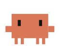 Install

```bash
claude plugin marketplace add Weazool/claude-mobile-companion
claude plugin install desk-companion@desk-companion
```

For development, add a local clone instead: `claude plugin marketplace add C:/path/to/claude-mobile-companion`.

Restart your Claude Code sessions so the hooks load. The first time the server starts, Windows asks whether Node may accept connections: allow **Private networks**.

##  Pair your phone

In Claude Code, run `/claude-companion-pair`. A page opens in your PC's browser with a QR code and a live preview of the dashboard; scan the code with your phone. On the PC itself, `http://localhost:<port>/` opens the dashboard without the token. The port is in `~/.desk-companion/config.json` (Windows: `%USERPROFILE%\.desk-companion\config.json`).

- **iPhone** (Safari or Chrome): Share → Add to Home Screen, then open it from the icon for full screen.
- **Android:** the first tap goes full screen.

##  On the phone

- **Two modes, in turn, 10 seconds a step.** Then it starts over. Tap a session to bring it up at once; the cycle carries on from there.
  - **Standard mode**, every session in turn: its row lights up, and Clawd, on the left, acts out what it's doing next to your limit bars and the list of sessions.
  - **Focus mode**, every session in turn: Clawd takes the top three quarters of the screen, with his caption under him as in standard mode, and acts the session out with the animations you picked (see Customise Clawd below). Under him is the session's own row from the list, twice the size; its ✕ stops tracking the session, as in the list. After 7 seconds your limit bars take his place for the last 3.
- **All your sessions.** The list shows every session and scrolls. Left alone, it follows the session that's up. Tap a session's **✕** to stop tracking it: it leaves the list and the cycle until you next prompt it or restart it, or until it needs your permission or has a question.

<p align="center">
  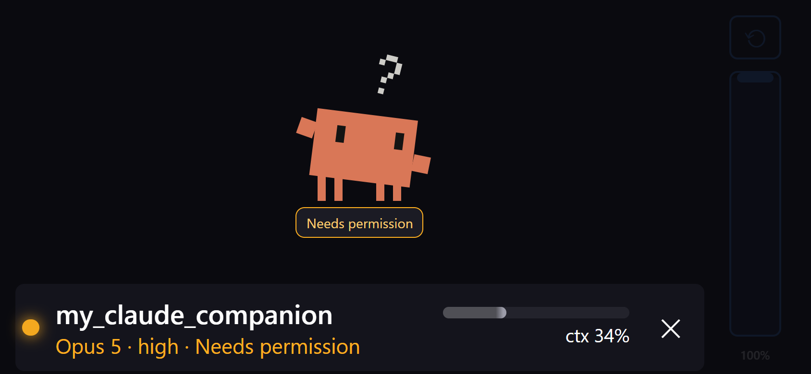
  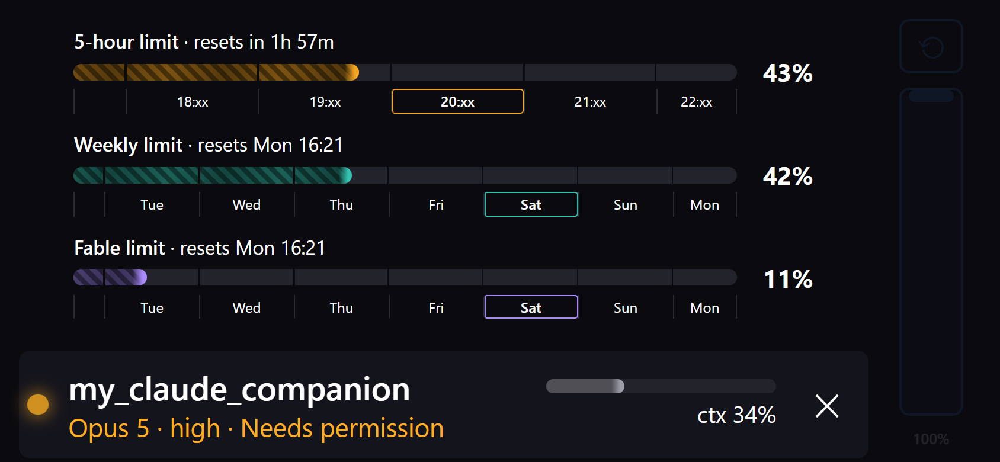
</p>

- **The rail on the right** (along the bottom when the layout is upright) holds two controls, one under the other:
  - **⟲** turns the layout 90° at a time, so it works with rotation lock on.
  - **The brightness slider** runs from 10% to 100%. Drag it or tap anywhere along it. The whole screen dims evenly, edges included. Nothing dims on its own; this slider is the only brightness control.

  The rail rests at 10% so it stays out of the way. Touch it to bring it up to full, then use the controls; that first touch never presses anything. It fades back 5 seconds after you last touch it. Both settings are remembered.
- **Burn-in protection.** Everything is built to keep an OLED screen from burning in:
  - **It drifts.** The whole dashboard moves slowly all the time, a few pixels either way, so no pixel stays lit in one place.
  - **Its bars flow.** Only the tip of each limit bar is in full colour. The rest is dimmed, with stripes that drift slowly along it.
  - **It sleeps.** When Clawd falls asleep (2 quiet minutes, or 2 minutes after a limit runs out), a screensaver takes over: the screen goes black and a small, dim Clawd with your three limit bars glides around it. Any Claude activity or a tap brings the dashboard back.
  - **It lets the phone lock.** While Claude works, the screen stays on. Once 30 minutes pass with no Claude Code activity and no taps, the page stops keeping the screen awake, so your phone locks on its own Auto-Lock. Unlock it and tap once to keep it on again.

The page keeps the screen awake while something is going on, so leave your phone's Auto-Lock at a normal setting (iPhone: Settings → Display & Brightness → Auto-Lock, e.g. 5 minutes). Keep-awake starts with your first tap on the dashboard. If the phone still locks while Claude is working, your browser isn't holding the screen awake, and Auto-Lock → Never (or Android Developer options → Stay awake while charging) is the fallback, without the lock after 30 quiet minutes.

##  Customise Clawd

You choose which animation Clawd plays for each thing he reacts to: Claude thinking, a permission prompt, your limits running low, a tap, falling asleep and more. In Claude Code, run `/claude-companion-configure`, open **Customise Clawd's behaviours →** on the pair page, or go to `http://localhost:<port>/behaviours`. The page only opens on the PC itself.

Every behaviour has a live preview, and a gallery at the bottom plays all 26 animations. Pick animations per behaviour and click **Save**: the phone switches over at once, with no reload. **Reset to defaults** puts everything back. The map is stored in `~/.desk-companion/behaviours.json` (Windows: `%USERPROFILE%\.desk-companion\behaviours.json`).

<p align="center">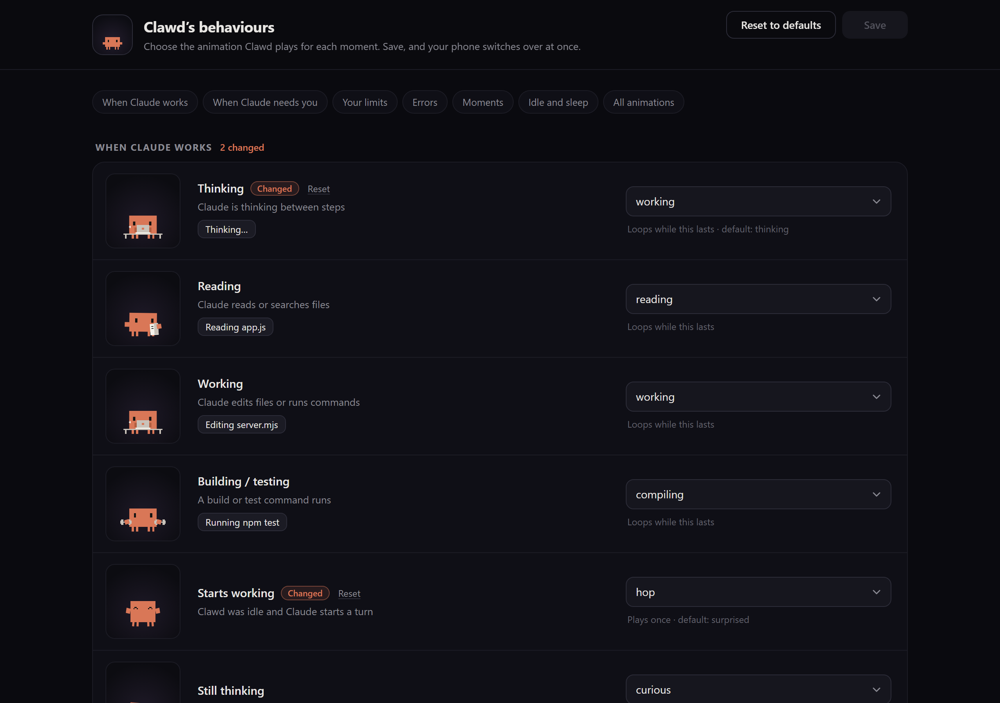</p>

##  Privacy

The phone sees:
- session names as the Claude app shows them (or the project folder name for a session without one), model, effort and context %;
- for Bash, only the program name, plus one subcommand for common dev tools (`git status`, `npm test`); a leading `cd …` is skipped;
- for file tools, only the file name;
- for MCP tools, only the tool's own name.

Prompts, file contents and command arguments are never sent. The plugin never reads your Claude credentials; limits come from Claude Code's own `get_usage`. The page is plain HTTP on your LAN, protected by a random token in the link.

##  Troubleshooting

- **The phone can't connect.** Open `/pair` on the PC and click one of the other addresses under the QR code. The first one isn't always the real Wi-Fi adapter: a virtual adapter, such as VirtualBox or Hyper-V, can sort first.
- **Windows Firewall.** The first time the server starts, allow Node on **Private networks** when asked.
- **The phone shows nothing new.** There is only ever one server, on one port, with one token, and the link never changes by itself. If something else on the PC holds that port, the server says so in `server.log` and stops rather than moving: free the port, or move desk-companion on purpose with `node bin/server.mjs --port <number>` (then re-pair with `/claude-companion-pair`). A session you have had open since an older version of the plugin can start that older server; the next start of the current one replaces it, and restarting those sessions stops it happening.
- **Logs** are in `~/.desk-companion/server.log` and `hook.log` (Windows: `%USERPROFILE%\.desk-companion\`).

##  Development

```bash
node --test                                # all tests
node bin/server.mjs --stop
node bin/pair.mjs                          # restart the server from a clone
node tools/fake-events.mjs turn            # also: limits, idle, wake, end
node tools/clawd-look.mjs <names|all>      # contact sheets of Clawd's animations, as PNGs
node tools/clawd-look.mjs --icon 256 --out src/web   # regenerate the Home Screen icon
node tools/clawd-apng.mjs working thinking ...       # animated PNGs of Clawd (the README ones: docs/images/clawd)
```

`src/web/clawd/mock.html` plays every animation and the mood engine's sequences in a browser. It's served at `/web/clawd/mock.html`, e.g. `http://localhost:<port>/web/clawd/mock.html`. `src/web/clawd/ANIMATING.md` is the guide to writing animations.

Hooks and `/claude-companion-pair` start the server from Claude Code's plugin cache whenever none is running, for example after a reboot, a crash or the `--stop` above. So after any change under `bin/`, `src/`, `skills/` or `hooks/`, bump `version` in `package.json` and `.claude-plugin/plugin.json`, then run:

```bash
claude plugin marketplace update desk-companion
claude plugin update desk-companion@desk-companion
```

Then restart Claude Code. Restarting the server from a clone only lasts until the next reboot.

##  Credits and licences

- Clawd is Anthropic's mascot. This SVG rig is an unofficial fan recreation for personal use and is not affiliated with or endorsed by Anthropic. Check Anthropic's trademark guidelines before redistributing it.
- The companion's state machine (`src/web/mood.js`) is adapted from [clawdio](https://github.com/cegware/clawdio) (© Anthrive3D, MIT); see `src/web/LICENSE-clawdio.txt`.
- [qrcode-generator](https://github.com/kazuhikoarase/qrcode-generator) by Kazuhiko Arase (MIT).
- [NoSleep.js](https://github.com/richtr/NoSleep.js) by Rich Tibbett (MIT).

MIT licence; see `LICENSE`.

<p align="center"></p>
